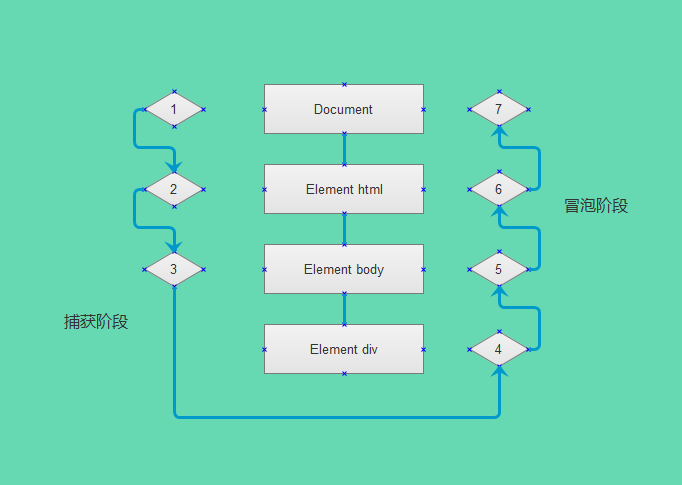

## JS 事件

javascript与HTML之间的交互是通过事件实现的。事件，就是文档或浏览器窗口中发生的一些特定的交互瞬间。可以使用侦听器（或处理程序）来预定事件，以便时间发生是至此那个相应的代码。这种在传统软件工程中被称之为观察员模式的模型，页面支持的行为（javascript代码）与页面的外观（html 和 CSS 代码）之间的松散耦合。

DOM2 级规范开始尝试以一种复合逻辑的方式来标准化DOM事假。IE9、Firefox、Opera、Safari 和 Chrome全部已经实现了‘DOM2 级事件’模块的核心部分。IE8 是最后一个任然使用其他专有事件系统的主要浏览器。

### 事件流

事件流描述的是从页面中接收到事件的顺序。IE的事件流是事件冒泡流，而Netscape Communicator 的事件流是事件捕获流。

#### 事件冒泡

IE的事件流叫做事件冒泡（event bubbing），即事件开始时有最具体的元素（文档中嵌套村官次最深的那个节点）接收，然后逐级向上传播到较为不具体的节点（文档）。如：

```
<!DOCTYPE html>
<html>
<head>
  <title>Event Bubbing Example</title>
</head>
<body>
  <div id="myDiv">click me</div>
</body>
</html>
```
如果你单击了页面中的div元素，那么这个click事件会按照如下顺序传播：
  div ——> body ——> html ——> document

所有现代浏览器都支持事件冒泡，但是在具体实现上还是有一些差别。IE5.5 及更早的版本中的事件冒泡会跳过 html 元素（从body直接跳到document）。IE9、Firefox、Chrome和Safari则将事件一直冒泡到window对象。

#### 事件捕获

事件捕获的思想是不太具体的节点应该更早的收到事件，而最具体的节点应该最后收到事件。事件捕获的用以在于在事件到达预定目标之前捕获它。以前面简单的html页面为例，点击div元素后，按照如下顺序传播：
  document ——> html ——> body ——> div

虽然事件捕获是Netscape Communicator 唯一支持的事件流模型，但是IE9、Safari、Opera 和 Firefox 目前也都支持这种事件流模型。尽管“DOM2 级事件”规范要求事件应该从document对象开始传播，但这些浏览器都是从window对象开始捕获事件的。

#### DOM 事件流

“DOM2 级事件”规定的事件流包括三个阶段：时间捕获阶段、处于目标阶段和事件冒泡阶段。实现发生的是事件捕获，为截获事件提供机会。然后是实际上的目标接收到事件。最后一个阶段是冒泡阶段。可以在这个阶段对事件做出相应。以前面简单的html页面为例，点击div元素后的触发事件顺序：



在DOM事件流中，实际的目标（div元素）在捕获阶段不会接收到事件。这意味着在捕获阶段，事件从document到html再到body后就停止了，下一个阶段是“处于目标”阶段，于是事件在div上发生，并在事件处理中被看成冒泡阶段的一部分，然后，冒泡阶段发生，事件又传播到文档。

### 事件处理程序

事件就是用户或浏览器自身执行的某种动作。诸如click、load和mouseover，都是事件的名称，而响应某个事件的函数就叫做函数处理程序（或事件侦听器）。事件处理程序的名称以 on 开头，因此click事件的处理程序就是onclick，load事件的事件处理程序就是onload。

#### HTML事件处理程序

某个元素支持的某种时间，都可以使用一个与相应事件处理程序同名的HTML特性来指定。这个特性的值应该是能够执行的javascript代码，如：
```
<input type="button" value="click me" onclick="alert('clicked')"> />
```
通过指定onclick特性，将一些javascript代码作为它的值来定义。由于这个值是javascript，因此不能在其中使用未经转移的html语法字符，如&、""、小于号 <、大于号 >。

在HTML中定义的事件处理程序可以包括要至此那个的具体动作。也可以调用在页面其他地方定义的脚本，如：
```
<script type="text/javascript">
  function showMessage() {
    alert('hello world!');
  }
</script>
<input type="button" value="click me" onclick="showMessage();" />
```
这样指定事件处理程序具有一些独到之处，首先，这样会创建一个封装这元素属性的函数，这个函数中有一个局部变量event，也就是事件对象。
```
<!-- 输出 click -->
<input type="button" value="click me" onclick="alert(event.type);" />
```
通过event变量，可以直接访问事件对象，你不用自己定义，也不用从函数的参数列表中读取，在这个函数的内部，this值等于事件的目标元素，如：
```
<!-- 输出 click me -->
<input type="button" value="click me" onclick="alert(this.value);" />
```
关于这个动态创建的函数，另一个有意思的地方是它扩展作用于的方式。在这个函数内部，可以向访问局部变量一样访问document及该元素本身的成员。这个函数使用with扩展作用域：
```
function() {
  with(document) {
    with(this) {
      // 元素属性值
    }
  }
}
```
这样，事件处理程序要访问自己的属性就简单多了，如：
```
<!-- 输出 click me -->
<input type="button" value="click me" onclick="alert(value);" />
```
如果当前元素是一个表单输入元素，则作用域中还会包含访问表单元素（父元素）的入口，如：
```
function() {
  with(document) {
    with(this.form) {
      with(this) {
        // 元素属性值
      }
    }
  }
}
```
实际上，这样扩展作用域的方式，无非就是想让事件处理程序无需引用表单元素就能访问其他表单字段。如：
```
<form method="post">
  <input type="text" name="username" value="" />
  <input type="button" value="Echo Username" onclick="alert(username.value)" />
</form>
```
这样扩展事件处理程序的作用域链在不同浏览器中会导致不同的结果。不同javascript引擎遵循的标识符解析规则略有差异，很可能会在访问非限定对象成员时出错。

通过HTML指定事件处理程序的最后一个缺点是HTML与javascript代码紧密耦合，如果要更改事件处理程序，就要改动两个地方：html代码和javascript代码。

#### DOM0 级事件处理程序
通过javascript指定事件处理程序的传统方式，就是将一个函数赋值给一个事件处理程序属性，这种为事件处理程序赋值的方法是在第四代web浏览器中出现的，而且至今仍然为所有现代浏览器所支持。原因一是简单，二是具有跨浏览器的优势，要使用javascript指定事件处理程序，首先必须取得一个重要的对象的引用。

每个元素（包括window 和document）都有自己的事件处理程序属性，这些属性通常全部消协，例如onclick。将这种属性的值设置为一个函数，就可以指定事件处理程序。如：
```
var btn = document.getElementById('myBtn');
btn.onclick = function() {
  alert('Clicked');
}
```
使用DOM0 级方法指定的事件处理程序被认为是元素的方法。因此，有时候的事件处理程序在元素的作用域中运行，换句话说，程序中的this应用当前元素。如：
```
var btn = document.getElementById('myBtn');
btn.onclick = function() {
  alert(this.id); // myBtn
}
```
不仅仅是id，实际上可以在事件处理程序中通过this访问元素的任何方法和属性。以这种方式添加的事件处理程序会在事件流的冒泡阶段被处理。

也可以删除通过DOM0 级方法指定的事件处理程序，如：
```
btn.onclick = null; // 删除事件处理程序
```

#### DOM2 级事件处理程序

"DOM2 级事件"定义了两个方法：addEventListener() 和 removeEventListener() 用于处理指定和删除事件处理程序。

#### IE事件处理程序

#### 跨浏览器的事件处理程序

### 事件对象

#### DOM 中的事件对象

#### IE 中的事件对象

#### 跨浏览器的事件对象


### 事件类型

#### UI 事件

#### 焦点事件

#### 鼠标与滚轮事件

#### 键盘与文本事件

#### 复合事件

#### 变动事件

#### HTML5 事件

#### 设备事件

#### 触摸与手势事件

### 内存和性能

#### 事件委托

#### 移除事件处理程序


### 模拟事件

#### DOM 中的事件模拟

#### IE 中的事件模拟

### 小结