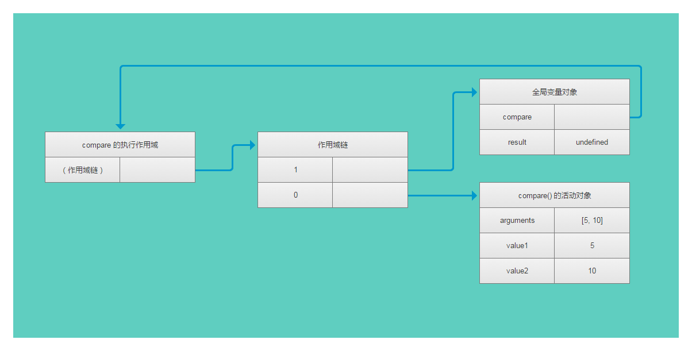

## 函数表达式

函数表达式是javascript中的一个既强大又令人困惑的特性

**定义函数的两种方式：**
1. 函数声明
  ```
  function funName(arg0, arg1, arg2) {
    // 函数体
  }
  ```
  **函数声明提升：在执行代码之前就会读取函数声明**
  ```
  sayHi();    // 不会报错，因为在代码执行之前就会先读取函数声明
  function sayHi() {
    alert('Hi'); 
  }
  ```
2. 函数表达式
  ```
  var funName = function(arg0, arg1, arg2) {
    // 函数体
  };
  ```
  function后面没有标识符。这种情况下创建的函数叫做匿名函数(anonymous function)，匿名函数有时候也叫拉姆达函数。
  ```
  sayHi();        // 会报错
  var sayHi = function() {
    alert('Hi'); 
  }
  // 理解函数提升的关键，在于理解函数声明与函数表达式之间的区别
  // 一定不要这么做
  if(condition) {
    function sayHi() {
      alert('Hi');
    }
  } else {
    funcion sayHi() {
      alert('Ya,ha!');
    }
  }
  // 可以改为
  var sayHi;
  if(condition) {
    sayHi = function {
      alert('Hi');
    }
  } else {
    sayHi = funcion {
      alert('Ya,ha!');
    }
  }
  ```

### 递归
递归函数是在一个函数通过名字调用自身的情况下构成的
```
function factorial(num) {
  if(num <= 1) {
    return 1;
  } else {
    return num * factorial(num - 1);
  }
}
```
经典的递归阶乘函数，上面的写法表面上看起来没问题，但是下面的写法去可能到导致他出错；
```
var anotherFactorial = factorial;
factoral = null;
alert(anotherfactorial(4)); // 出错 调用的时候factorial已经不再是个函数了。
```
在这种情况下，使用arguments.callee 可以解决这个问题。
```
function factorial(num) {
  if(num <= 1) {
    return 1;
  } else {
    return num * arguments.callee(num - 1); //  arguments.callee 是一个执行正在执行的函数的指针，可以用他来实现对函数的递归调用
  }
}
```
在严格模式下，不能通过脚本访问arguments.callee， 访问这个属性会报错。可以使用函数表达式来达成相同的效果
```
var factorial = (function f(num) {
  if(num <= 1) {
    return 1;
  } else {
    return num * f(num - 1); // 这种写法在严格模式或非严格模式下都行得通。
  }
})
```

### 闭包
闭包是指有权访问另一个函数作用与中变量的函数。创建闭包的常见方式，在一个函数内部创建另一个函数。
```
function createComparisonFunction(propertyName) {
  return function(object1, object2) {
    var value1 = object1[propertyName]; // 之所以能访问到propertyName 是因为内部函数的作用域链中包含了外部函数的作用域。
    var value2 = object2[propertyName];
    if(value1 < value2) {
      return - 1; 
    } else if(value1 > value2) {
      return 1;
    } else {
      return 0;
    }
  };
}
```
**当某个函数被调用时，会创建一个执行环境（execution context）以及相应的作用域链。然后使用arguments和其他命名参数的值来初始化函数的活动对象（activation object）。但在作用域链中，外部函数的活动对象始终处于第二位，外部函数的外部函数处于第三位，直到作为作用域链重点的全局执行环境**

在函数执行过程中，为读取和写入变量的值，就需要在作用域链中查找变量。
```
function compare(value1, value2) {
  if(value1 < value2) {
    return -1;
  } else if(value1 > value2) {
    return 1;
  } else {
    return 0;
  }
}
var result = compare(5, 10);

```


后台的每个执行环境都有一个表示变量的对象——变量对象。全局环境的变量对象始终存在，而像compare()函数这样的局部环境的变量对象，则只在函数执行的过程中存在。在创建compare()函数时，会创建一个预先包含全局变量对象的作用域链。这个作用域链被保存在内部的[[Scope]]属性中。当调用compare()函数时，会为函数创建一个执行环境，然后通过复制函数的[[Scope]]属性中的对象构建起执行环境的作用域链。此后，又有一个活动对象，被创建并被推入执行环境作用域链的前端。对于这个例子中的compare() 函数的执行环境而言，其作用域链中包含两个变量对象：本地活动对象和全局变量对象。显然，作用域链本质上是一个指向变量对象的指针列表，它只引用，但不实际包含变量对象。
无论什么时候在函数中访问一个变量是，就会从作用域链中搜索具有相对名字的变量，一般来讲，当函数执行完毕后，局部活动对象就会被销毁。内存中仅保存全局作用域，但是，闭包的情况又有所不同。