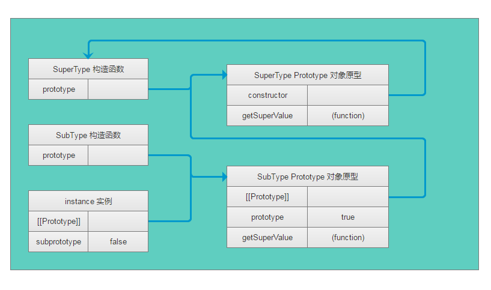

## js面向对象 —— 继承

继承是OO语言中一个最为人津津乐道的概念。许多OO语言都支持两种继承方式： 接口继承和实现继承。接口继承只继承方法签名，而实现继承则继承实际方法。
由于函数没有签名，在ECMAScript中无法实现接口继承。只支持实现继承，而且其实现继承主要是依靠原型链来实现的

### 原型链
ECMAScript将原型链作为实现继承的主要方法。基本思想是： 利用原型让一个引用类型继承另一个应用类型的属性和方法。
**构造函数、原型和实例的关系：每个构造函数都有一个原型对象，原型都包含一个指向构造函数的指针，而每个实例都包含一个指向原型对象的内部指针**
实现原型链有一种基本模式, 如：
```
function SuperType() {
  this.property = true;
}
SuperType.prototype.getSuperValue = function() {
  return this.property;
};
function SubType() {
  this.subproperty = false;
}
// 继承了SupperType
SubType.prototpye = new SuperType();
SubType.prototype.getSubValue = function() {
  return this.subproperty;
}
var instance = new SubType();
alert(instance.getSuperValue()); // true

```


通过是i按原型链，本质上扩展了原型搜索机制。 当读取模式访问一个实例属性时，首先会在实例中搜索该属性，如果没有找到，则会继续搜索实例的原型。在通过原型链实现继承的情况下，搜索过程就得以沿着原型链继续向上。就拿例子来说： 调用instance.getSupervalue()会经历三个搜索步骤： 1. 搜索实例。2. 搜索SubType.prototype。3. 搜索SuperType.prototype。

#### 1. 别忘记默认的原型
所有的引用类型默认都继承了Object。 一定要记住，所有函数的默认原型都是Object的实例。因此默认原型都会包含一个内部指针，指向Object。prototype。


#### 2. 确定原型和实例的关系
可以通过两个方法来确定原型和函数之间的关系。
  - 使用instanceof操作符，用这个操作符来测试实例域原型链中出现过的构造函数，结果都会返回true
    ```
    alert(instance instanceof Object); // true
    alert(instance instanceof SuperType); // true
    alert(instance instanceof SubType); //true
    ```
  - 使用isPrototypeOf()。只要原型链中出现过的原型。都可以说是该原型链所派生的实例的原型。
    alert(Object.prototype.isprototypeOf(instance)); // true
    alert(SuperType.prototype.isprototypeOf(instance)); // true
    alert(SubType.prototype.isprototypeOf(instance)); // true

#### 3. 谨慎定义方法
子类有时候需要覆盖超类型中的某个方法。或者需要添加超类中不存在的某个方法。但不管怎么样，给原型添加一个方法的代码一定要放在替换原型的语句之后。
```
function SuperType() {
  this.property = true;
}
SuperType.prototype.getSuperValue = function() {
  return this.property;
};
function SubType() {
  this.subproperty = false;
}
// 继承了SupperType
SubType.prototpye = new SuperType();

// 新添加方法
SubType.prototype.getSubValue = function() {
  return this.subproperty;
}
// 重写超类型中的方法
SubType.prototype.getSuperValue = function() {
  return false;
}

var instance = new SubType();
alert(instance.getSuperValue()); // false
```

#### 4. 原型链的问题
原型链虽然很强大，但是他也存在一些问题，其中最主要的问题来自包含应用类型值的原型。 引用类型值的圆形属性会被所有实例共享。而这也正是为什么要在构造函数中能够，而不是在源性对象中定义属性的原因。在通过原型来实现继承时，原型实际上会变成另一个类型的实例，于是，原来的实例属性也顺理成章的变成了现在的原型属性了。
```
function SuperType() {
  this.colors = ['red', 'blue', 'yellow']; // 引用类型
}
function SubType(){}
// 继承SuperType
SubType.prototype = new SuperType();

var instance1 = new SubType();
instance.colors.push('green'); 
alert(instance.colors); // red, blue, yellow, green

var instance2 = new SubType();
alert(instance.colors); // red, blue, yellow, green
```
原型链的第二个问题： 在创建子类型的实例时，不能向超类型的构造函数中传递对象。

### 借用构造函数
在解决原型中包含引用类型的所带来的问题，可以使用 **借用构造函数**。
它的基本思想是: 在子类构造函数的内部调用超类构造函数。（函数只不过是在特定环境中指定代码的对象）通过使用apply() 和call()也可以在新创建的对象上执行构造函数
```
function SuperType() {
  this.colors = ['red', 'blue', 'yellow']; // 引用类型
}

function SubType(){
  // 继承SuperType
  SuperType.call(this); // 借调了超类型的构造函数
}

var instance1 = new SubType();
instance.colors.push('green'); 
alert(instance.colors); // red, blue, yellow, green

var instance2 = new SubType();
alert(instance.colors); // red, blue, yellow
```

#### 1. 传递参数
相对于原型链而言，借用构造函数有一个很大的优势，可以在子类构造函数中向超累构造函数传递参数
```
function SuperType(name) {
  this.name = name;
}

function SubType(){
  // 继承SuperType, 同时传递了参数
  SuperType.call(this, 'zhangsan'); 
  this.age = 20;
}

var instance1 = new SubType();
instance.name; //zhangsan
instance.age;//20

```

#### 2. 借用构造函数问题
如果仅仅是借用构造函数，那么无法避免构造函数模式存在的问题——方法都是在构造函数中定义，因此函数复用就无从谈起了。

### 组合继承
组合继承也叫伪经典继承。指的是将原型链和借用构造函数的技术组合到一起。其背后的思路是使用原型链实现对圆形属性和方法的继承，而通过借用函数来实现对实力属性的继承。即在原型上定义方法实现了函数复用，又能保证每个实例有它自己的属性。
```
function SuperType(name) {
  this.name = name;
  this.colors = ['red', 'blue', 'yellow'];
}
SuperType.prototype.sayName = function() {
  alert(this.name);
};
function SubType(name, age){
  // 继承SuperType, 同时传递了参数
  SuperType.call(this, name);          // 第二次调用你SuperType()
  this.age = age;
}

// 继承方法
SubType.prototype = new SuperType();   // 第一次调用你SuperType()
SubType.prototype.constructor = SubType;
SubType.prototype.sayAge = function() {
  alert(this.age);
}

var instance1 = new SubType('zhangsan', 20);
instance1.colors.push('green');
alert(instance1.colors); // red, blue, yellow, green
instance1.sayName(); // zhangsan
instance1.sayAge(); //20

var instance2 = new SubType('lisi', 22);
alert(instance1.colors); // red, blue, yellow
instance1.sayName(); // lisi
instance1.sayAge(); //22

```
组合继承避免了原型链和借用构造函数的缺陷，融合了他们的优点，成为javascript中最常用的继承模式。而且instanceof和isPrototypeOf() 也能够用于识别基于组合继承创建的对象

### 原型式继承
道格拉斯·克罗克福德 在2006年的一篇文章中，介绍了一种实现继承的方法，这种方法并没有使用严格意义上的构造函数。
原理是借助原型可以基于已有的对象创建新对象，同时还不必一次创建自定义类型
```
function object(o) {
  function F(){}
  F.prototype = o;
  return new F();
}
```
ECMAScript 5 新增Object.create() 规范化了原型式继承。这个方法接收两个参数： 一个用作新对象原型的对象 和 一个为新对象定义额外属性的对象（可选的）。
```
var person = {
  name: 'zhangsan',
  frends: ['xiaohei', 'xiaohua', 'xiaobai'];
}
var anotherPerson = Object.create(person);
anotherPerson.name = 'lisi';
anotherPerson.friends.push('xiaolan');

var yetAnotherPerson = Object.create(person);
yetAnotherPerson.name = 'wangwu';
yetAnotherPerson.friends.push('xiaozi');

alert(person.friends); // xiaohei, xiaohua, xiaobai, xiaolan, xiaozi 
```
Object.create() 的第二个参数格式: 每个属性都是通过自己的描述符定义的，以这种发那个是指定的任何属性都会覆盖原型对象上的同名属性
```
var person = {
  name: 'zhangsan',
  frends: ['xiaohei', 'xiaohua', 'xiaobai'];
}
var anotherPerson = Object.create(person, {
  name: {
    value: 'lisi';
  }
});
alert(anotherPerson.name); // lisi

```

### 寄生式继承
寄生式继承是与原型式继承紧密相关的一种思路。即创建一个仅用于封装集成过程的函数，该函数在内部以某种方式来增强对象。最后再想真正是他做了所有工作一样返回对象。
```
function createAnother(original) {
  var clone = Object(original); // 通过调用函数创建一个新对象
  clone.sayHi = function() { 
    alert('hi');
  }
  return clone; 
}
var person = {
  name: 'zhangsan',
  frends: ['xiaohei', 'xiaohua', 'xiaobai'];
}
var anotherPerson = CreateAnother(person);
anotherPereson.sayHi();// hi

```

### 寄生组合式继承
所谓寄生组合式继承：就是通过借用构造函数来继承属性。通过原型链来继承方法。基本思想是： 不必为了指定子类型的原型而调用超类型的构造函数。使用寄生式继承来继承超类型的原型。然后再将结果指定给子类型的原型
```
function inheritPrototype(subType, superType) {
  var prototype = Object(superType.prototype);  // 创建对象
  prototype.constructor = subType;   // 增强对象
  subType.prototype = prototype;     // 指定对象
}

function SuperType(name) {
  this.name = name;
  this.colors = ['red', 'blue', 'yellow'];
}
SuperType.prototype.sayName = function() {
  alert(this.name);
}
function SubType(name, age) {
  SuperType.call(this, name);
  this.age = age;
}
inheritPrototype(SubType, SuperType);
SubType.prototype.sayAge = function() {
  alert(this.age);
}
```

