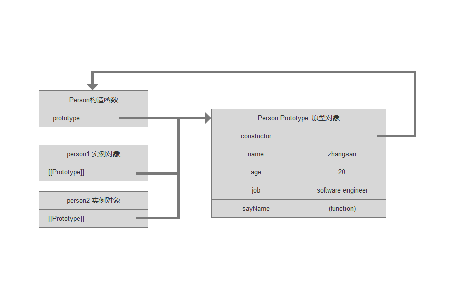

## js 面向对象

面向对象（Object-oriented，OO）的语言有一个标志，那就是他们都有类的概念。可以通过类创建任意多个具有相同属性和方法的对象。

ECMA-262 把对象定义为：无序属性的集合，其中属性可以包含基本值、对象或者函数。我们可以把ECMAScript的对象想象成散列表： 无非就是一组键值对。其中值可以是数据或函数。每个对象都是基于一个引用类型创建的，一个引用类型可以是原生类型，也可以是开发人员自定义的类型。

### 理解对象

```
// 第一种 创建一个Object实例，然后添加属性和方法
var person = new Object();
person.name = '张三';
person.age = 30;
person.job = "software engineer";
person.sayName = function() {
  return this.name;
}
// 第二种 对象字面量的写法，现在比较常见
var person = {
  name: '张三',
  age: 30,
  job: "software engineer",
  sayName: function() {
    return this.name;
  }
}

```
#### 属性类型

ECMAScript 中有两种属性： 数据属性和访问器属性

1. 数据属性
  数据属性包含一个数据值的未知。在这个位置可以读取和写入，有4个描述其行为的特性：
    - [[Configurable]]: 表示能否通过delete删除属性从而重新定义属性。能否修改属性的特性，或者能否把属性修改为访问器属性。直接在对象中定义的属性，特性默认true
    - [[Enumerable]]: 表示能否通过for-in循环返回属性，直接在对象中定义的属性，特性默认true
    - [[Writable]]: 表示能否修改属性的值，直接在对象中定义的属性，特性默认true
    - [[Value]]: 包含这个属性的数据值。读取属性值的时候，从这个位置读，写入属性值的时候把新值保存在这个未知，这个特性的默认值是undefined

  要修改属性默认的特性，必须使用ECMAScript 5 的Object.defineProperty() 方法。接收三个参数： 属性所在的对象，属性的名称和一个描述符对象。其中描述符对象的属性值必须是：configurable、enumerable、writable和value，可以设置其中的一或多个值。

  > IE8 是第一个实现Object.defineProperty() 的浏览器版本。然后这个版本的实现存在诸多限制：只能在DOM对象上使用这个方法。而且只能创建访问器属性。建议不要在IE8中使用。

2. 访问器属性
  访问器属性不包含数据值。它包含一对getter和setter函数，不过这两个函数都不是必须的。在读取访问器属性时，会调用getter函数，这个函数负责返回有效的值，在写入访问器属性时。会调用setter函数传入新值，这个函数负责决定如何处理数据。
  访问器属性的4个特性：
    - [[Configurable]]: 表示能否通过delete删除属性从而重新定义属性，能否修改属性的特性，或者能否把属性修改为数据属性。直接在对象中定义的属性，特性默认true
    - [[Enumerable]]: 表示能否通过for-in 返回属性，直接在对象中定义的属性，特性默认true
    - [[Get]]: 在读取属性时调用的函数，默认值为undefined
    - [[Set]]: 在写入属性时调用的函数，默认值为undefined

  访问属性值不能直接定义。必须使用Object.definedProperty()来定义。
  ```
  var book = {
    _year: 2016, // 下划线是一种常用标志。用于表示只能通过对象方法访问的属性
    edition: 1
  };
  Object.defineProperty(book, 'year', {
    get: function() {
      return this._year;
    },
    set: function(newValue) {
      if(newValue > 2016) {
        this._year = newValue;
        this.edition += newValue -2016;
      }
    }
  });
  book.year = 2017;
  alert(book.edition);
  ```
#### 定义多个属性
  Object.defineProperties() 可以通过描述符一次定义多个属性。这个方法接收两个对象参数：第一个对象是要添加和修改 其属性的对象。第二个参数与第一个对象中添加或修改的属性一一对应：
  ```
  var book = {};
  Object.definedProperties(book, {
    _year: {
      writable: true,
      value: 2016,
    },
    edition: {
      writable: true,
      value: 1
    },
    year: {
      get: function() {
        return this._year;
      },
      set: function(newValue) {
        if(newValue > 2016) {
          this._year = newValue;
          this.edition += newValue -2016;
        }
      }
    }
  });
  ```
#### 读取属性的特性

Object.getOwnPropertyDescriptor() 可以取得给定属性的描述符，接收两个参数： 属性所在的对象和要读取其描述符的属性名称，返回一个对象，如果是访问器属性，这个对象属性有configurable、enumerable、get和set。如果是数据属性，这个对象的属性有configurable、enumerable、writable和value

### 创建对象
虽然Object构造函数或对象字面量都可以用来创建单个对象，但是这些方法有个明显的缺点：使用同一个接口创建很多对象，会产生大量的重复代码，为了解决这个问题，人们开始使用工厂模式的一种变体。

#### 1. 工厂模式
工厂模式抽象了创建具体对象的过程。用一种函数来封装以特定接口创建对象的细节
```
function createPerson(name, age, job) {
  var o = new Object();
  o.name = name;
  o.age = age;
  o.job = job;
  o.sayName = function() {
    alert(this.name);
  }
  return o;
}
var person1 = createPerson('zhangsan', 22, 'software engineer');
var person2 = createPerson('lisi', 29, 'doctor');
```
工厂模式虽然解决了创建多个相似对象的问题，但是没有解决对象识别问题。

#### 2. 构造函数模式
ECMAScript 中的构造函数可以用来创建特定类型的对象。像Object和Array这样的原生构造函数，在运行时会自动出现在执行环境中。此外，也可以创建自定义的构造函数，从而定义自定义对象类型的属性和方法。
```
function Person(name, age, job) {
  this.name = name;
  this.age = age;
  this.job = job;
  this.sayName = function() {
    alert(this.name);
  }
}
var person1 = new Person('zhangsan', 22, 'software engineer');
var person2 = new Person('lisi', 29, 'doctor');
```
与工厂模式中的不同之处：
- 没有显式的创建对象
- 直接将属性和方法复制给了this对象
- 没有return语句
- 函数名使用的是大写。按照管理构造函数始终都应该以一个大写字母开头，而非构造函数则用小写开头。

> 构造函数本身也是函数，只不过可以用来创建对象。

要创建Person实例，必须使用new操作符，过程：
  1. 创建一个对象
  2. 将构造函数的作用域赋给新对象（因此this就执行了这个新对象）
  3. 执行构造函数中的代码（为这个新对象添加属性）
  4. 返回新对象
在前面的例子person1 和person2分别保存着Person的一个不同实例。这两个对象都有一个constructor（构造函数）属性，该属性指向Person
  alert(person1.constructor == Person); // true
对象的constructor属性最初是用来表示对象类型的。但是，提到监测对象类型。还是instranceof操作符要更可靠一些。
创建自定义的构造函数意味着将来可以将他的实例标识为一种特定的类型。而这正是构造函数模式胜过工厂模式 的地方。

1. 将构造函数当作函数
构造函数和其他函数的唯一区别，在于调用他们的方式不同。任何函数只要通过new操作符来调用，那么它就可以作为构造函数，任何函数，如果不通过new操作符来调用，那么它跟普通函数也不会有什么区别。
```
// 当作构造函数使用
var person = new Person('zhangsan', 22, 'software engineer');
person.sayName(); // zhangsan
// 作为普通函数调用
Person('lisi', 22, 'software engineer');
window.sayName(); // lisi  用这种方式定义的构造函数是定义在Global对象中的（在浏览器中就是window对象）
// 在另一个对象的作用于中调用
var o = new Object();
Person.call(o, 'wangwu', 30, 'nurse');
o.sayName(); // wangwu

```

2. 构造函数的问题


### 原型模式
每个函数都有一个prototype属性，这个属性是一个指针，指向一个对象，而这个对象的用途是包含可以有特定类型的所有实例共享的属性和方法，那么prototype就是通过调用构造函数而创建的那个对象向实例的原型对象。
使用原型对象的好处是可以让所有对象实例共享它所包含的属性和方法。 也就是说，不必构造函数中定义对象实例，而是可以将这些信息直接添加到原型对象中。
```
function Person() {}
Person.prototype.name = "zhangsan";
Person.prototype.age = 20;
Person.prototype.job = "software engineer";
Person.prototype.sayName = function() {
  alert(this.name);
}
var person = new Person();
person.sayName(); // zhangsan
var person2 = new Person();
person2.sayName(); // zhangsan
alert(person1.sayName == person2.sayName); // true
```
他原型对象与构造函数不同的是，新对象的这些属性和方法是有所有实例共享的的。

1. 理解原型对象
无论什么时候，只要创建了一个新函数，就会根据一组特定的规则为该函数创建一个prototype属性，这个属性指向函数的原型对象。在默认情况下，所有原型对象都会自动获得一个constructor（构造函数）属性，这个属性是一个指向prototype属性所在函数的指针。



每当代码读取某个对象的某个属性时，都会执行一次搜索，目标是具有给定名字的属性。搜过首先从对象实例本身开始，如果在失利中找到了具有给定名字的属性，则返回该属性的值，如果没有找到。则继续搜索指针执行的原型对象，如果在原型对象中找到了这个属性，则返回该属性值。
原型最初值包含constructor属性，而该属性也是共享的，因此可以通过对象实例访问。

虽然可以通过对象实例访问保存在原型中的值，但却不能通过对象实例重写对象中的值。如果我们在实例中添加了一个属性，而该属性与原型中的一个属性同名。那我们就在实例中创建了该属性，该属性将会屏蔽原型中的那个属性。
```
function Person(){}
Person.prototype.name = "zhangsan";
Person.prototype.age = 20;
Person.prototype.job = "software engineer";
Person.prototype.sayName = function() {
  alert(this.name);
}
var person1 = new Person();
var person2 = new Person();
person1.name = 'lisi';
alert(person1.name); // list
alert(person2.name); //zhangsan

delete person1.name;  // 删除实例对象中的name属性，返回原型对象中的name属性
alert(person1.name); // zhangsan
```